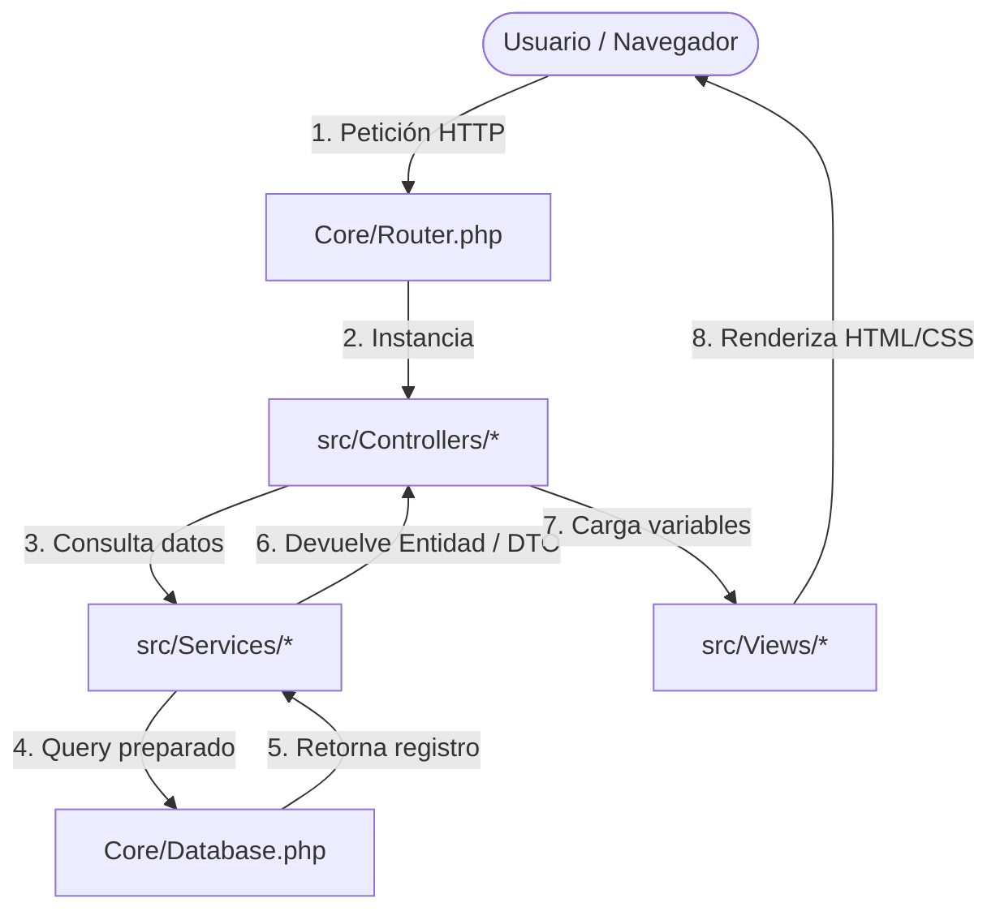

# 🎓 Guía de Exposición — Segundo Avance
## Sistema de Gestión de Inventario y Ventas · Rectificadora de Repuestos

Este documento sirve como material de preparación y defensa frente al jurado para la presentación del **segundo avance (~78% de desarrollo)** del sistema.

---

## 📋 1. Ficha Técnica del Proyecto

* **Nombre del Sistema:** Sistema de Gestión de Inventario y Ventas para Rectificadora de Repuestos.
* **Arquitectura:** MVC (Modelo-Vista-Controlador) nativo en PHP 8.
* **Base de Datos:** MySQL / MariaDB (Esquema relacional optimizado con índices y claves foráneas).
* **Despliegue:** Serverless en **Vercel** (`vercel.json` + enrutador serverless) con base de datos en la nube.
* **Estado Actual:** **78% de Avance funcional**.

---

## 🏗️ 2. Arquitectura de Software y Estructura

El sistema se ha desarrollado **desde cero sin frameworks pesados** (como Laravel o Symfony) para demostrar solidez técnica en programación web pura.

### Componentes Core (Directorio `Core/`)
1. **`Router.php`**: Enrutador dinámico que lee las peticiones GET/POST, extrae parámetros dinámicos de las URLs (ej. `/repuestos/editar/12`) y ejecuta la acción correspondiente en el controlador.
2. **`Database.php`**: Implementa el patrón **Singleton** para mantener una única conexión activa a la BD usando PDO, evitando el consumo excesivo de sockets. Maneja transacciones atómicas de forma segura.
3. **`Csrf.php`**: Proporciona tokens criptográficos de un solo uso para proteger todos los formularios de ataques de Falsificación de Petición en Sitios Cruzados (CSRF).
4. **`Flash.php`**: Motor de notificaciones flash basado en sesiones para avisar al usuario tras operaciones de guardado, error o validación.

---

## 📦 3. Módulos Implementados e Hitos Técnicos

### 🔑 A. Autenticación y Seguridad (RF1)
* **Control de Sesiones Seguro:** Implementa timeouts de inactividad (1 hora) y regeneración de ID de sesión (`session_regenerate_id`) en el login para prevenir el secuestro de sesión (*session fixation*).
* **Matriz de Permisos (RBAC):** Sistema basado en roles (`administrador` y `empleado`). El administrador posee acceso ilimitado (`all`), mientras que el empleado tiene permisos restringidos (solo puede registrar ventas e inventario, sin acceso a crear usuarios, editar repuestos críticos o anular ventas).

### ⚙️ B. Catálogo de Repuestos y Semáforo de Stock (RF4-RF7)
* **Visualización de Niveles:** El sistema calcula de forma dinámica y visual el estado de cada repuesto mediante un semáforo de colores:
  * 🔴 **Crítico**: Stock menor o igual al límite configurado (se requiere reposición inmediata).
  * 🟡 **Bajo**: Stock por debajo del stock mínimo recomendado.
  * 🟢 **Óptimo**: Stock dentro del rango estándar.
* **Búsqueda Avanzada:** Filtros en tiempo real por nombre, código de barra/pieza y categoría con paginación integrada.

### 📥 C. Movimientos de Inventario (RF8-RF10)
* Soporte para tres tipos de movimientos: **Entradas** (abastecimiento), **Salidas** (mermas/retiros) y **Ajustes** (corrección de stock tras inventario físico).
* Historial de auditoría completo y filtros avanzados de movimientos para un control total del almacén.

### 🛒 D. Módulo de Ventas y Concurrencia (RF13-RF15)
* **Carrito Multilínea:** Permite agregar múltiples ítems a una misma transacción con cálculo dinámico de totales, subtotales e impuestos en tiempo real.
* **Aplicación de Descuentos:** Soporte para descuentos directos en caja.
* **Control de Concurrencia (Bloqueo Pesimista):** Evita la sobreventa en entornos multiusuario. Al registrar una venta, el sistema usa una transacción de base de datos con bloqueo (`SELECT ... FOR UPDATE`) sobre las filas de repuestos correspondientes, asegurando la consistencia física del inventario.
* **Anulación:** Permite anular ventas devolviendo el stock afectado al almacén en una transacción atómica segura.

### 📊 E. Dashboard y Reportes (RF16-RF18)
* **Panel de Control:** Gráficos dinámicos interactivos de **Chart.js** (distribución de repuestos por categoría y volumen de movimientos en los últimos 7 días).
* **Moneda Dual:** Interruptor en cabecera para visualizar todos los precios del sistema dinámicamente entre Soles (PEN) y Dólares (USD).
* **Exportación:** Generación en tiempo real de archivos CSV para reportes de ventas, stock crítico y movimientos de almacén.

---

## 🛡️ 4. Seguridad Implementada (Puntos Clave para Defender)

Si el jurado pregunta sobre la seguridad del sistema:

1. **Inyección SQL:** Mitigada al 100% mediante el uso exclusivo de **PDO con Sentencias Preparadas** (*Prepared Statements*). Ningún input del usuario se concatena directamente en las consultas SQL.
2. **Cross-Site Scripting (XSS):** Todas las salidas impresas en pantalla se filtran mediante `htmlspecialchars($val, ENT_QUOTES, 'UTF-8')`.
3. **Cross-Site Request Forgery (CSRF):** Cada formulario genera un token único que es validado en el controlador antes de procesar cualquier acción de escritura (POST).
4. **Session Hijacking:** Las contraseñas están almacenadas usando el algoritmo de hashing seguro **BCrypt** (`password_hash`).

---

## ❓ 5. Preguntas Frecuentes del Jurado (FAQ de Exposición)

> [!IMPORTANT]
> **Pregunta: ¿Por qué no utilizaron un Framework como Laravel?**
> **Respuesta:** Optamos por desarrollar un framework MVC nativo a medida para demostrar nuestro conocimiento profundo del protocolo HTTP, manejo de sesiones, enrutamiento manual y la gestión interna del patrón de diseño MVC en PHP. Esto garantiza además que el sistema sea extremadamente ligero y óptimo para entornos serverless como Vercel sin dependencias excesivas.

> [!WARNING]
> **Pregunta: ¿Cómo aseguran que dos empleados no vendan el mismo repuesto al mismo tiempo si solo queda 1 en stock?**
> **Respuesta:** Implementamos **bloqueo pesimista** en la base de datos. Al iniciar el proceso de registro de venta, se abre una transacción SQL y se realiza un `SELECT ... FOR UPDATE` del stock de los repuestos implicados. Esto bloquea temporalmente esas filas en la BD, impidiendo que otra petición paralela disminuya el stock hasta que finalice o aborte la primera venta.

> [!NOTE]
> **Pregunta: ¿Qué elementos hacen falta para completar el 100% en la última entrega?**
> **Respuesta:** El sistema está al ~78% y funcional en su core de ventas e inventario. Falta completar:
> 1. El módulo de **Compras a Proveedores** para alimentar el stock directamente desde facturas de compra.
> 2. Exportación a **PDF** de boletas, facturas y reportes gráficos.
> 3. Un **Módulo de Auditoría Avanzada** (logs de acciones detallados por usuario).
> 4. CRUD para administración de **Categorías** desde la UI.

---

## 🚀 6. Demo en Vivo: Flujo Recomendado de Presentación

Para impresionar al jurado en la presentación, sigue este recorrido lógico:

1. **Inicio de Sesión:** Muestra el login seguro con el tema oscuro elegante.
2. **Dashboard:** Explica el panel con los gráficos interactivos, el reloj en tiempo real y el switch de moneda PEN/USD.
3. **Catálogo de Repuestos:** Busca un repuesto y muestra el estado de alerta del semáforo visual.
4. **Hacer una Venta:** Agrega múltiples ítems al carrito, aplica un descuento y confirma la venta. Muestra cómo se descuenta automáticamente el stock en el catálogo.
5. **Historial de Movimientos / Reportes:** Muestra el historial del movimiento generado y descarga el reporte en formato CSV para demostrar la portabilidad de datos.
